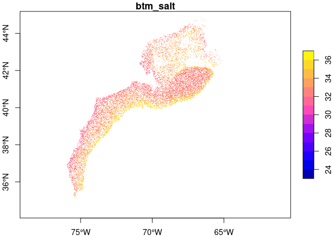
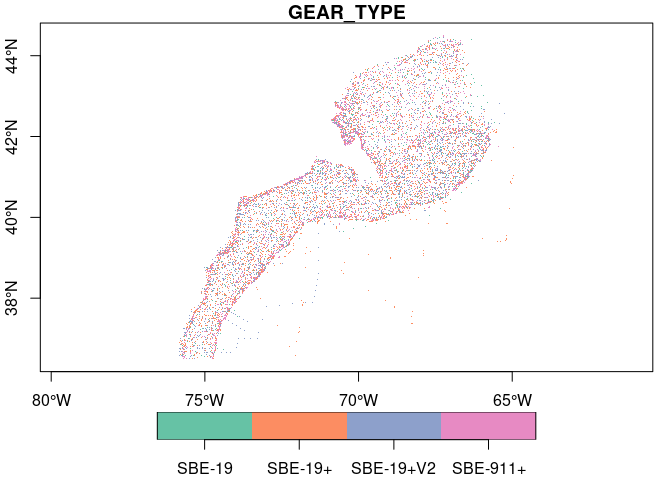

EcoMon
================

An R package to locally serve
[EcoMon](https://www.fisheries.noaa.gov/about/northeast-fisheries-science-center)
data. This package assists in the download of online datasets and
simplifies local management. Note that this dataset provides
**unstaged** data.

The package includes functionality for working with **staged** datasets
by species. These datasets may be made available upon request from
[NEFSC](https://www.fisheries.noaa.gov/about/northeast-fisheries-science-center).

Finally, the package includes functionality to read NOAA’s CTD table for
cruises located within the extent of the ecomon project. The data are
provided via personal communication.

## Requirements

- [R v4.1+](https://www.r-project.org/)

- [rlang](https://CRAN.R-project.org/package=rlang)

- [dplyr](https://CRAN.R-project.org/package=dplyr)

- [readr](https://CRAN.R-project.org/package=readr)

- [sf](https://CRAN.R-project.org/package=sf)

## Installation

    remotes::install_github("BigelowLab/ecomon")

## Initial Use

The premise of this package is that data may be stored in a single
location but accessed by many users. To achieve this resource-friendly
goal and still simplified access for each user, we need to inform the
package where the data resides. We do this by storing the path to the
data location in each user’s home directory in a hidden text file,
“~/.ecomon”. That text file has just one line in it which contains the
full path to the shared dataset. For example, the author’s contains
`/mnt/ecocast/coredata/noaa/nmfs/nefsc` which points to a shared network
drive mounted on our linux platform.

When the package is first loaded (ala `library(ecomon)`) the existence
of the file is check, and if missing a warning is issued.

You can create and populate that `~/.ecomon` using a text editors, or
you can create using the provided function `set_data_path()`. Here is
how the author created his own…

    library(ecomon)
    ecomon::set_data_path("/mnt/ecocast/coredata/noaa/nmfs/nefsc")

That’s it. If you ever move the data you’ll have to modify the contents
of this hidden text file.

## Fetching new **unstaged** data from [EcoMon](https://www.fisheries.noaa.gov/about/northeast-fisheries-science-center)

At the time of this writing there is only one data set,
[0187513](https://www.ncei.noaa.gov/archive/accession/download/0187513)
to download. So…

    library(ecomon)
    ok <- fetch_ecomon(id = "0187513")

Now the data directory will contain a subdirectory name `0187513` which
we can list…

``` r
library(ecomon)
ff <- list_data(id = "0187513")
head(ff)
```

    ## [1] "/mnt/ecocast/coredata/noaa/nmfs/nefsc/0187513/3.3/data/0-data/EcoMon_Plankton_Data_v3_8.csv"

OK - it only has one file of interest.

## Working with **staged** data obtained by request

These come in Excel format which must be exported to CSV. These should
have somewhere in the filename the name of the species. Place a copy of
the CSV into the “staged” subdirectory of your data path. If you don’t
have a “staged” directory then make one. You may have older versions of
the CSV for a given species. In that case the software assumes the most
recently modified file is the correct one, but you can override the
filename.

## Working with CTD tabular data obtained by request

This comes in a CSV file which should be rewritten as “noaa_ctd.csv.gz”
(hint: use `readr::write_csv(x, "/path/to/noaa_ctd.csv.gz")`). Place
this file into a subdirectory called “ctd” in your data path.

## Reading local **unstaged** data

It’s is very simple to read the data into a data frame (well, a tibble
actually). Make your request by `id` (yes, we only know of one ecomon
dataset, but hope springs eternal…)

``` r
x <- read_ecomon(list_data(id = "0187513"), simplify = TRUE) |>
  dplyr::glimpse()
```

    ## Rows: 32,693
    ## Columns: 14
    ## $ cruise_name <chr> "AA8704", "AA8704", "AA8704", "AA8704", "AA8704", "AA8704"…
    ## $ station     <dbl> 42, 43, 44, 45, 46, 47, 48, 49, 50, 51, 52, 53, 54, 55, 56…
    ## $ zoo_gear    <chr> "6B3", "6B3", "6B3", "6B3", "6B3", "6B3", "6B3", "6B3", "6…
    ## $ ich_gear    <chr> "6B5", "6B5", "6B5", "6B5", "6B5", "6B5", "6B5", "6B5", "6…
    ## $ lat         <dbl> 38.7500, 38.9500, 38.9167, 39.1000, 39.2333, 39.3500, 39.2…
    ## $ lon         <dbl> -73.7500, -74.1167, -74.5500, -74.3167, -74.4333, -74.1000…
    ## $ date        <date> 1987-04-17, 1987-04-17, 1987-04-17, 1987-04-17, 1987-04-1…
    ## $ time        <time> 00:45:00, 02:50:00, 04:35:00, 06:05:00, 07:00:00, 08:35:0…
    ## $ depth       <dbl> 54, 46, 28, 24, 18, 26, 43, 79, 81, 56, 25, 18, 22, 28, 23…
    ## $ sfc_temp    <dbl> NA, NA, NA, NA, NA, NA, NA, NA, NA, NA, NA, NA, NA, NA, NA…
    ## $ sfc_salt    <dbl> NA, NA, NA, NA, NA, NA, NA, NA, NA, NA, NA, NA, NA, NA, NA…
    ## $ btm_temp    <dbl> NA, NA, NA, NA, NA, NA, NA, NA, NA, NA, NA, NA, NA, NA, NA…
    ## $ btm_salt    <dbl> NA, NA, NA, NA, NA, NA, NA, NA, NA, NA, NA, NA, NA, NA, NA…
    ## $ volume_1m2  <dbl> 18.91, 16.72, 12.32, 6.03, 3.50, 8.60, 9.87, 55.40, 57.48,…

Alternatively, you can read the data in as a
[sf](https://CRAN.R-project.org/package=sf) POINT object.

``` r
x <- read_ecomon(list_data(id = "0187513"), simplify = TRUE, form = 'sf')
plot(x['btm_salt'], axes = TRUE, pch = ".")
```

<!-- --> The data,
currently v3.3, has this date range: 1977-02-13, 2021-11-15

## Reading local **staged** data

Read the data into a data frame (`tibble`) or `sf` object by species
name.

``` r
x <- read_staged(species = "calfin", form = "sf")
plot(x['gear_volume_filtered'], axes = TRUE, pch = ".", logz = TRUE)
```

    ## Warning in classInt::classIntervals(v0, min(nbreaks, n.unq), breaks, warnSmallN
    ## = FALSE): var has infinite values, omitted in finding classes

<!-- -->

## Reading local CTD data

Read the data into a data frame (tibble) of `sf` object. There are many
more cruises in the ctd data than in the staged data, so you can use the
staged data to filter the ctd to a more manageable size.

``` r
# x is staged data from above
ctd <- read_ctd(match_cruise = x, form = "sf")
plot(ctd['GEAR_TYPE'], axes = TRUE, pch = ".", key.pos = 1)
```

<!-- -->
