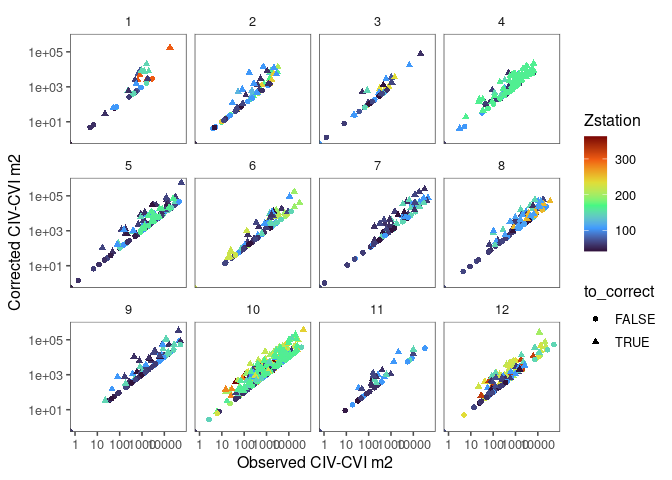
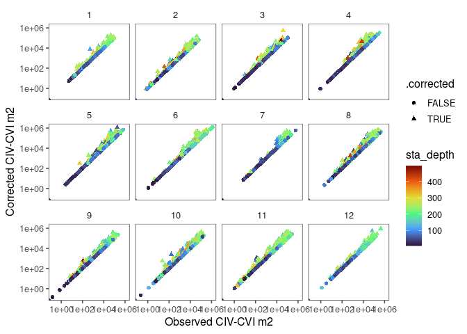

AZMP Correction
================

## Background AZMP-Ecomon correction models

From personal communication from [Caroline
Lehoux](mailto:Caroline.Lehoux@dfo-mpo.gc.ca%3E)

### Files

Two `mgcv::gamm()` model files (use `readRDS(filename)`) specifically
for correcting *C fin* abundance in samples taken from sites with
`< 500m` depth.

- Cfin_CIV_CVIgamms3_4_remove01.rds

- Cfin_CV_CVIgamms3_4_remove01.rds

``` r
model = read_azmp_model(filename = "Cfin_CIV_CVI")
```

One example data set we’ll use to verify our setup. Note that the data
is actually Gulf of Maine ecomon data, but used to implement the AZMP
correction.

``` r
x = read_azmp_example() |>
  glimpse()
```

    ## Rows: 1,349
    ## Columns: 24
    ## $ Region       <chr> "GOM", "GOM", "GOM", "GOM", "GOM", "GOM", "GOM", "GOM", "…
    ## $ ID           <chr> "1995-1-12_-67.552_41.389_1951_4", "1995-1-12_-67.552_41.…
    ## $ ID_lab       <chr> "1995_1_-67.552_41.389", "1995_1_-67.552_41.389", "1995_1…
    ## $ DATA_SET     <chr> "GOM_globec", "GOM_globec", "GOM_globec", "GOM_globec", "…
    ## $ STATION      <chr> "4", "4", "5", "5", "5", "5", "7", "7", "7", "7", "7", "1…
    ## $ Date         <chr> "1995-1-12", "1995-1-12", "1995-1-14", "1995-1-14", "1995…
    ## $ Year         <dbl> 1995, 1995, 1995, 1995, 1995, 1995, 1995, 1995, 1995, 199…
    ## $ Month        <dbl> 1, 1, 1, 1, 1, 1, 1, 1, 1, 1, 1, 1, 1, 1, 1, 1, 10, 10, 1…
    ## $ Day          <dbl> 12, 12, 14, 14, 14, 14, 15, 15, 15, 15, 15, 21, 21, 21, 2…
    ## $ LONGITUDE    <dbl> -67.552, -67.552, -66.521, -66.521, -66.521, -66.521, -66…
    ## $ LATITUDE     <dbl> 41.389, 41.389, 41.670, 41.670, 41.670, 41.670, 42.326, 4…
    ## $ ZMin         <dbl> 15.7, 29.7, 4.1, 15.0, 40.7, 61.6, 4.3, 13.1, 38.9, 100.2…
    ## $ ZMax         <dbl> 29.7, 44.0, 15.0, 40.7, 61.6, 75.0, 11.1, 38.0, 99.0, 272…
    ## $ Zstation     <dbl> 44, 44, 75, 75, 75, 75, 300, 300, 300, 300, 300, 150, 150…
    ## $ percZ_stn    <dbl> 0.67500000, 1.00000000, 0.20000000, 0.54266667, 0.8213333…
    ## $ TAXON_STADE  <chr> "Cfin_CIV_CVI", "Cfin_CIV_CVI", "Cfin_CIV_CVI", "Cfin_CIV…
    ## $ TAXON        <chr> "Cfin", "Cfin", "Cfin", "Cfin", "Cfin", "Cfin", "Cfin", "…
    ## $ STADE        <chr> "CIV_CVI", "CIV_CVI", "CIV_CVI", "CIV_CVI", "CIV_CVI", "C…
    ## $ ind.m2       <dbl> 65.11309, 66.50837, 817.04981, 679.27643, 588.89347, 377.…
    ## $ ind.m2_total <dbl> 131.6215, 131.6215, 2462.7878, 2462.7878, 2462.7878, 2462…
    ## $ propind      <dbl> 0.494699647, 0.505300353, 0.331758108, 0.275816065, 0.239…
    ## $ pcum         <dbl> 0.49469965, 1.00000000, 0.33175811, 0.60757417, 0.8466907…
    ## $ fMonth       <dbl> 1, 1, 1, 1, 1, 1, 1, 1, 1, 1, 1, 1, 1, 1, 1, 1, 10, 10, 1…
    ## $ lZstation    <dbl> 3.784190, 3.784190, 4.317488, 4.317488, 4.317488, 4.31748…

We assume the following meanings…

- `ZStation` station depth
- `ZMax` tow depth
- `percZ_stn` fraction of tow depth relative to station depth
- `ind.m2` abundance of Cfin_IV_VI
- `ind.m2_total` not sure

### Methodology

A multi-step process including..

#### Manage depths `> 500m`

``` r
max_depth = 500
handle_deep = c("drop", "clip")[1]
if(tolower(handle_deep) == "drop"){
  x = x |>
    filter(Zstation < max_depth)
} else if(tolower(handle_deep) == "clip") {
  x = x |>
    mutate(Zstation=ifelse(Zstation > max_depth, max_depth, Zstation)) 
}
```

#### Sorochan criteria - flag data to correct

“percZ_stn \< 95% and \> 15m above bottom. because stations sampled less
than 200m not always sampled accurately. minimum depth in GAM is 40 so
avoiding extrapolation.”

``` r
sorochan = TRUE
max_percent_z = 95
min_above_bottom = 15
min_station_depth = 40
if (sorochan){
  x = x |>
    mutate(to_correct = percZ_stn < max_percent_z/100 & 
                        (Zstation - ZMax) > min_above_bottom & 
                        Zstation > min_station_depth )
}
```

#### Predict and correct flagged data

``` r
# for clarity, these are the records to correct, trimmed to the columns required
y = x |>
  filter(to_correct) |>
  select(all_of(c("percZ_stn", "Zstation", "ID", "fMonth")))

# here we apply 
x = x |>  
  mutate(predicted_pcum = ifelse(to_correct, 
                                 predict(model, y, 
                                         type="response", 
                                         exclude ='s(ID)', 
                                         newdata.guaranteed = FALSE), 
                                 1),
         corrected_CIV_CVI_m2 = ind.m2/predicted_pcum) |>
  glimpse()
```

    ## Rows: 1,254
    ## Columns: 27
    ## $ Region               <chr> "GOM", "GOM", "GOM", "GOM", "GOM", "GOM", "GOM", …
    ## $ ID                   <chr> "1995-1-12_-67.552_41.389_1951_4", "1995-1-12_-67…
    ## $ ID_lab               <chr> "1995_1_-67.552_41.389", "1995_1_-67.552_41.389",…
    ## $ DATA_SET             <chr> "GOM_globec", "GOM_globec", "GOM_globec", "GOM_gl…
    ## $ STATION              <chr> "4", "4", "5", "5", "5", "5", "7", "7", "7", "7",…
    ## $ Date                 <chr> "1995-1-12", "1995-1-12", "1995-1-14", "1995-1-14…
    ## $ Year                 <dbl> 1995, 1995, 1995, 1995, 1995, 1995, 1995, 1995, 1…
    ## $ Month                <dbl> 1, 1, 1, 1, 1, 1, 1, 1, 1, 1, 1, 1, 1, 1, 1, 1, 1…
    ## $ Day                  <dbl> 12, 12, 14, 14, 14, 14, 15, 15, 15, 15, 15, 21, 2…
    ## $ LONGITUDE            <dbl> -67.552, -67.552, -66.521, -66.521, -66.521, -66.…
    ## $ LATITUDE             <dbl> 41.389, 41.389, 41.670, 41.670, 41.670, 41.670, 4…
    ## $ ZMin                 <dbl> 15.7, 29.7, 4.1, 15.0, 40.7, 61.6, 4.3, 13.1, 38.…
    ## $ ZMax                 <dbl> 29.7, 44.0, 15.0, 40.7, 61.6, 75.0, 11.1, 38.0, 9…
    ## $ Zstation             <dbl> 44, 44, 75, 75, 75, 75, 300, 300, 300, 300, 300, …
    ## $ percZ_stn            <dbl> 0.67500000, 1.00000000, 0.20000000, 0.54266667, 0…
    ## $ TAXON_STADE          <chr> "Cfin_CIV_CVI", "Cfin_CIV_CVI", "Cfin_CIV_CVI", "…
    ## $ TAXON                <chr> "Cfin", "Cfin", "Cfin", "Cfin", "Cfin", "Cfin", "…
    ## $ STADE                <chr> "CIV_CVI", "CIV_CVI", "CIV_CVI", "CIV_CVI", "CIV_…
    ## $ ind.m2               <dbl> 65.11309, 66.50837, 817.04981, 679.27643, 588.893…
    ## $ ind.m2_total         <dbl> 131.6215, 131.6215, 2462.7878, 2462.7878, 2462.78…
    ## $ propind              <dbl> 0.494699647, 0.505300353, 0.331758108, 0.27581606…
    ## $ pcum                 <dbl> 0.49469965, 1.00000000, 0.33175811, 0.60757417, 0…
    ## $ fMonth               <dbl> 1, 1, 1, 1, 1, 1, 1, 1, 1, 1, 1, 1, 1, 1, 1, 1, 1…
    ## $ lZstation            <dbl> 3.784190, 3.784190, 4.317488, 4.317488, 4.317488,…
    ## $ to_correct           <lgl> FALSE, FALSE, TRUE, TRUE, FALSE, FALSE, TRUE, TRU…
    ## $ predicted_pcum       <dbl> 1.00000000, 1.00000000, 0.09527869, 0.12526447, 1…
    ## $ corrected_CIV_CVI_m2 <dbl> 65.11309, 66.50837, 8575.36747, 5422.73815, 588.8…

``` r
ggplot(x, 
       mapping = aes(x=(ind.m2), 
                     y=(corrected_CIV_CVI_m2)))+
  geom_point(mapping = aes(shape=to_correct, col=Zstation)) +
  facet_wrap(~Month) +
  theme_few() +
  scale_x_continuous(trans="log10", name="Observed CIV-CVI m2")+
  scale_y_continuous(trans="log10", name="Corrected CIV-CVI m2")+
  scale_color_viridis_c(option="turbo")
```

<!-- -->

# Usage in the ecomon package

Read in staged ecomon data

``` r
x = read_staged(species = "calfin", form = "tibble") |>
  glimpse()
```

    ## Rows: 24,387
    ## Columns: 18
    ## $ seq                  <dbl> 23221, 23222, 23223, 23224, 23225, 23226, 23227, …
    ## $ cruise_name          <chr> "MM7701", "MM7701", "MM7701", "MM7701", "MM7701",…
    ## $ station              <dbl> 2, 3, 5, 7, 8, 9, 15, 16, 19, 20, 23, 26, 29, 33,…
    ## $ latitude             <dbl> 41.1833, 41.0167, 41.0000, 40.5167, 40.2667, 40.1…
    ## $ longitude            <dbl> -70.6667, -70.6667, -71.5000, -71.0167, -71.5000,…
    ## $ date                 <date> 1977-02-13, 1977-02-13, 1977-02-13, 1977-02-13, …
    ## $ sta_depth            <dbl> 33, 48, 49, 77, 84, 84, 91, 152, 109, 73, 62, 65,…
    ## $ tow_depth            <dbl> 25, 43, 38, 77, 78, 74, 90, 112, 87, 63, 56, 63, …
    ## $ gear_volume_filtered <dbl> 222.702, 222.539, 296.209, 500.050, 654.279, 664.…
    ## $ zoo_aliquot          <dbl> 256, 256, 256, 512, 512, 256, 512, 64, 64, 256, 2…
    ## $ total_m2             <dbl> 28.738, 49.465, 65.683, 157.680, 244.153, 57.044,…
    ## $ c6_m2                <dbl> 28.73795, 0.00000, 65.68335, 78.84012, 183.11454,…
    ## $ c5_m2                <dbl> 0.00000, 0.00000, 0.00000, 78.84012, 61.03818, 0.…
    ## $ c4_m2                <dbl> 0.00000, 49.46549, 0.00000, 0.00000, 0.00000, 0.0…
    ## $ c3_m2                <dbl> 0.0000, 0.0000, 0.0000, 0.0000, 0.0000, 0.0000, 0…
    ## $ c2_m2                <dbl> 0.0000, 0.0000, 0.0000, 0.0000, 0.0000, 0.0000, 0…
    ## $ c1_m2                <dbl> 0, 0, 0, 0, 0, 0, 0, 0, 0, 0, 0, 0, 0, 0, 0, 0, 0…
    ## $ unk_m2               <dbl> 0, 0, 0, 0, 0, 0, 0, 0, 0, 0, 0, 0, 0, 0, 0, 0, 0…

Correct stages IV-VI accepting all defaults

``` r
xc = correct_azmp(x, stages = c("c4_m2", "c5_m2", "c6_m2")) |>
  glimpse()
```

    ## Rows: 24,367
    ## Columns: 25
    ## $ seq                  <dbl> 23221, 23222, 23223, 23224, 23225, 23226, 23227, …
    ## $ cruise_name          <chr> "MM7701", "MM7701", "MM7701", "MM7701", "MM7701",…
    ## $ station              <dbl> 2, 3, 5, 7, 8, 9, 15, 16, 19, 20, 23, 26, 29, 33,…
    ## $ latitude             <dbl> 41.1833, 41.0167, 41.0000, 40.5167, 40.2667, 40.1…
    ## $ longitude            <dbl> -70.6667, -70.6667, -71.5000, -71.0167, -71.5000,…
    ## $ date                 <date> 1977-02-13, 1977-02-13, 1977-02-13, 1977-02-13, …
    ## $ sta_depth            <dbl> 33, 48, 49, 77, 84, 84, 91, 152, 109, 73, 62, 65,…
    ## $ tow_depth            <dbl> 25, 43, 38, 77, 78, 74, 90, 112, 87, 63, 56, 63, …
    ## $ gear_volume_filtered <dbl> 222.702, 222.539, 296.209, 500.050, 654.279, 664.…
    ## $ zoo_aliquot          <dbl> 256, 256, 256, 512, 512, 256, 512, 64, 64, 256, 2…
    ## $ total_m2             <dbl> 28.738, 49.465, 65.683, 157.680, 244.153, 57.044,…
    ## $ c6_m2                <dbl> 28.73795, 0.00000, 65.68335, 78.84012, 183.11454,…
    ## $ c5_m2                <dbl> 0.00000, 0.00000, 0.00000, 78.84012, 61.03818, 0.…
    ## $ c4_m2                <dbl> 0.00000, 49.46549, 0.00000, 0.00000, 0.00000, 0.0…
    ## $ c3_m2                <dbl> 0.0000, 0.0000, 0.0000, 0.0000, 0.0000, 0.0000, 0…
    ## $ c2_m2                <dbl> 0.0000, 0.0000, 0.0000, 0.0000, 0.0000, 0.0000, 0…
    ## $ c1_m2                <dbl> 0, 0, 0, 0, 0, 0, 0, 0, 0, 0, 0, 0, 0, 0, 0, 0, 0…
    ## $ unk_m2               <dbl> 0, 0, 0, 0, 0, 0, 0, 0, 0, 0, 0, 0, 0, 0, 0, 0, 0…
    ## $ Month                <dbl> 2, 2, 2, 2, 2, 2, 2, 2, 2, 2, 2, 2, 2, 2, 2, 2, 2…
    ## $ fMonth               <fct> 2, 2, 2, 2, 2, 2, 2, 2, 2, 2, 2, 2, 2, 2, 2, 2, 2…
    ## $ percZ_stn            <dbl> 0.7575758, 0.8958333, 0.7755102, 1.0000000, 0.928…
    ## $ .corrected           <lgl> FALSE, FALSE, FALSE, FALSE, FALSE, FALSE, FALSE, …
    ## $ .ind_m2              <dbl> 28.73795, 49.46549, 65.68335, 157.68023, 244.1527…
    ## $ .predicted_pcum      <dbl> 1.0000000, 1.0000000, 1.0000000, 1.0000000, 1.000…
    ## $ .corrected_ind_m2    <dbl> 28.73795, 49.46549, 65.68335, 157.68023, 244.1527…

Note the `.ind_m2` and `.corrected_ind_m2`.

``` r
ggplot(xc, 
       mapping = aes(x=.ind_m2, 
                     y=.corrected_ind_m2))+
  geom_point(mapping = aes(shape=.corrected, col=sta_depth)) +
  facet_wrap(~Month) +
  theme_few() +
  scale_x_continuous(trans="log10", name="Observed CIV-CVI m2")+
  scale_y_continuous(trans="log10", name="Corrected CIV-CVI m2")+
  scale_color_viridis_c(option="turbo")
```

<!-- -->
